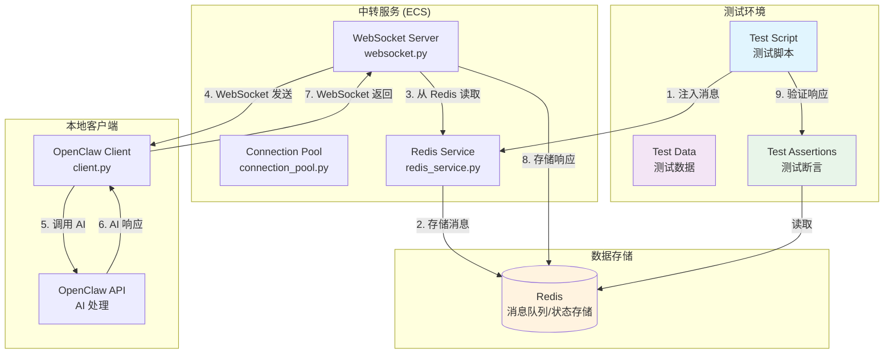

# E2E 测试架构设计文档

> 版本: v1.0.0
> 更新时间: 2026-03-24
> 作者: OpenCode

---

## 一、概述

### 1.1 背景

OpenClaw 微信频道插件涉及多个组件：
- 微信服务号（第三方 API，无法直接测试）
- ECS 中转服务（WebSocket 服务端）
- 本地 OpenClaw 客户端
- Redis 数据存储

**核心挑战**：微信 API 无法在测试环境中调用，需要设计替代方案。

### 1.2 测试目标

通过 **Redis 消息注入** 绕过微信 API 限制，实现端到端测试：
- 验证消息发送和接收流程
- 验证错误处理机制
- 验证重连机制
- 验证高并发场景

### 1.3 核心思路

```
┌─────────────────────────────────────────────────────────────────────────┐
│                     E2E 测试架构 - Redis 注入方案                         │
├─────────────────────────────────────────────────────────────────────────┤
│                                                                         │
│   [测试脚本]                                                            │
│       │                                                                 │
│       │ 1. 注入测试消息到 Redis                                         │
│       ▼                                                                 │
│   ┌─────────────┐      2. 转发消息        ┌─────────────────┐          │
│   │   Redis     │ ──────────────────────► │  本地 OpenClaw  │          │
│   │  (消息队列)  │                         │     客户端       │          │
│   └─────────────┘ ◄────────────────────── └─────────────────┘          │
│       ▲              3. AI 处理并返回                                    │
│       │                                                                 │
│       │ 4. 验证响应内容                                                  │
│       │                                                                 │
│   [测试断言]                                                            │
│                                                                         │
└─────────────────────────────────────────────────────────────────────────┘
```

**绕过微信 API 的关键**：中转服务通过 `pool.send_to_user(openid, message)` 发送消息，我们可以直接模拟这个过程。

---

## 二、测试架构图



---

## 三、测试场景设计

### 3.1 场景分类

| 场景编号 | 场景名称 | 优先级 | 测试目标 |
|----------|----------|--------|----------|
| TC-001 | 正常消息发送 | P0 | 验证完整消息流程 |
| TC-002 | 正常消息接收 | P0 | 验证 AI 响应返回 |
| TC-003 | 无效消息格式 | P1 | 验证错误处理 |
| TC-004 | 超时处理 | P1 | 验证超时机制 |
| TC-005 | 重连机制 | P0 | 验证断线重连 |
| TC-006 | 高并发测试 | P2 | 验证并发处理能力 |
| TC-007 | 设备绑定恢复 | P1 | 验证历史设备重连 |
| TC-008 | 用量限制 | P1 | 验证免费额度控制 |

### 3.2 详细测试场景

#### TC-001: 正常消息发送

**前置条件**：
- 客户端已启动并连接到中转服务
- 用户已授权绑定
- Redis 服务正常

**测试步骤**：
1. 测试脚本向 Redis 注入测试消息
2. 中转服务读取消息并通过 WebSocket 发送
3. 客户端接收消息

**验证点**：
- 消息格式正确
- 消息内容完整
- 响应时间 < 5s

#### TC-002: 正常消息接收

**前置条件**：
- 同 TC-001
- 本地 OpenClaw API 正常运行

**测试步骤**：
1. 客户端调用 OpenClaw API
2. 获取 AI 响应
3. 通过 WebSocket 发送响应

**验证点**：
- AI 响应非空
- 响应格式正确
- 消息成功存入 Redis

#### TC-003: 无效消息格式

**测试数据**：
```json
// 缺少必要字段
{"type": "chat_request"}

// 无效的 type
{"type": "invalid_type", "openid": "test", "content": "test"}

// 空内容
{"type": "chat_request", "openid": "test", "content": ""}
```

**验证点**：
- 返回错误消息
- 不影响后续消息处理
- 错误日志记录正确

#### TC-004: 超时处理

**测试步骤**：
1. 模拟 OpenClaw API 响应超时（>120s）
2. 客户端返回超时错误

**验证点**：
- 返回超时错误消息
- 客户端不崩溃
- 可继续处理后续消息

#### TC-005: 重连机制

**测试步骤**：
1. 强制断开 WebSocket 连接
2. 等待客户端自动重连
3. 发送测试消息验证

**验证点**：
- 重连延迟符合预期（指数退避）
- 重连后消息正常收发
- 设备绑定状态恢复

#### TC-006: 高并发测试

**测试参数**：
- 并发连接数：100
- 每连接消息数：10
- 总消息数：1000

**验证点**：
- 消息无丢失
- 响应正确匹配
- 平均响应时间 < 10s
- 无内存泄漏

#### TC-007: 设备绑定恢复

**测试步骤**：
1. 记录设备绑定状态
2. 重启客户端
3. 验证自动恢复绑定

**验证点**：
- device_id 保持不变
- openid 绑定恢复
- 无需重新扫码

#### TC-008: 用量限制

**测试步骤**：
1. 模拟已用完免费额度
2. 发送消息
3. 验证拒绝响应

**验证点**：
- 返回额度用完提示
- 不调用 AI API
- 统计数据正确

---

## 四、测试数据结构

### 4.1 测试消息格式

#### 4.1.1 客户端请求消息（模拟微信到客户端）

```python
# chat_request - 文本消息
{
    "type": "chat_request",
    "openid": "oFb8866iAh903OZht3CukuNwEcXc",  # 测试用户 OpenID
    "content": "你好，这是一条测试消息",
    "msg_type": "text"  # 可选，默认 text
}

# chat_request - 图片消息
{
    "type": "chat_request",
    "openid": "oFb8866iAh903OZht3CukuNwEcXc",
    "msg_type": "image",
    "pic_url": "https://example.com/test.jpg",
    "media_id": "test_media_id"
}
```

#### 4.1.2 客户端响应消息（模拟客户端到微信）

```python
# chat_response - AI 响应
{
    "type": "chat_response",
    "openid": "oFb8866iAh903OZht3CukuNwEcXc",
    "content": "你好！我是 AI 助手，有什么可以帮助你的吗？",
    "client_version": "1.2.0"
}

# chat_response - 错误响应
{
    "type": "chat_response",
    "openid": "oFb8866iAh903OZht3CukuNwEcXc",
    "content": "⚠️ OpenClaw 服务异常 (500)\n\n请稍后重试。",
    "client_version": "1.2.0"
}
```

#### 4.1.3 系统消息

```python
# ping/pong 心跳
{"type": "ping"}
{"type": "pong"}

# status 查询
{"type": "status"}
{
    "type": "status_response",
    "device_id": "bare_abc123_bluth_20260324_a1b2",
    "is_authorized": true,
    "openid": "oFb8866iAh903OZht3CukuNwEcXc"
}

# register 注册
{
    "type": "register",
    "instance_type": "local",
    "device_id": "bare_abc123def4567890_bluth_20260324120000_a1b2",
    "device_type": "bare",
    "machine_id": "abc123def4567890",
    "system_username": "bluth",
    "client_version": "1.2.0",
    "min_server_version": "1.0.0",
    "is_new_device": false
}

# registered 注册响应
{
    "type": "registered",
    "device_id": "bare_abc123def4567890_bluth_20260324120000_a1b2",
    "auth_url": "https://claw.7color.vip/auth-channel?device_id=xxx",
    "server_version": "1.1.0",
    "is_recovery": true,
    "recovered_openid": "oFb8866iAh903OZht3CukuNwEcXc"
}
```

### 4.2 预期响应格式

#### 4.2.1 成功响应

```python
# AI 正常响应
{
    "status": "success",
    "openid": "oFb8866iAh903OZht3CukuNwEcXc",
    "response": {
        "type": "chat_response",
        "content": "AI 生成的回复内容..."
    },
    "latency_ms": 1234,
    "timestamp": "2026-03-24T10:30:00Z"
}
```

#### 4.2.2 错误响应

```python
# 格式错误
{
    "status": "error",
    "error_code": "INVALID_MESSAGE_FORMAT",
    "error_message": "Missing required field: openid",
    "timestamp": "2026-03-24T10:30:00Z"
}

# 超时错误
{
    "status": "error",
    "error_code": "TIMEOUT",
    "error_message": "OpenClaw API response timeout after 120s",
    "timestamp": "2026-03-24T10:30:00Z"
}

# 未授权错误
{
    "status": "error",
    "error_code": "UNAUTHORIZED",
    "error_message": "Device not authorized",
    "timestamp": "2026-03-24T10:30:00Z"
}
```

### 4.3 Redis 键名规范

```python
# 用户设备绑定
"user:{openid}:devices"           # SET - 用户所有设备
"user:{openid}:active_device"     # STRING - 当前激活设备
"device:{device_id}"              # STRING (JSON) - 设备信息

# 用户状态
"user:connection:{openid}"        # STRING - 设备 ID（兼容旧版）
"client:binding:{device_id}"      # STRING - openid（兼容旧版）

# 用量统计
"credits:{openid}:{date}"         # STRING - 当日使用量
"stats:messages:{date}"           # STRING - 消息统计
"stats:connections:{date}"        # STRING - 连接统计

# 消息去重
"msg:processed:{msg_id}"          # STRING - 已处理消息 ID
```

---

## 五、Redis 注入方案

### 5.1 注入方式

**方案一：直接调用 ConnectionPool（推荐）**

```python
# 测试脚本直接调用中转服务的 ConnectionPool
from relay.src.services.connection_pool import get_connection_pool

async def inject_message(openid: str, content: str):
    pool = get_connection_pool()
    message = {
        "type": "chat_request",
        "openid": openid,
        "content": content
    }
    success = await pool.send_to_user(openid, message)
    return success
```

**方案二：模拟 Redis 消息队列**

```python
# 通过 Redis LPUSH 模拟消息入队
import redis.asyncio as aioredis
import json

async def inject_message_via_redis(openid: str, content: str):
    redis = await aioredis.from_url("redis://localhost:6379")
    message = {
        "type": "chat_request",
        "openid": openid,
        "content": content,
        "timestamp": datetime.utcnow().isoformat()
    }
    # 存储到 Redis，供中转服务读取
    await redis.lpush(f"test:message:{openid}", json.dumps(message))
```

### 5.2 消息流程模拟

```python
class E2ETestRunner:
    """E2E 测试运行器"""
    
    def __init__(self):
        self.pool = get_connection_pool()
        self.redis = get_redis_service()
        self.test_openid = "oFb8866iAh903OZht3CukuNwEcXc"
        self.test_device_id = "bare_test123_bluth_20260324_test"
    
    async def setup(self):
        """测试环境初始化"""
        # 1. 模拟设备绑定
        await self.redis.register_device(
            device_id=self.test_device_id,
            openid=self.test_openid,
            machine_id="test123",
            instance_type="bare"
        )
        
        # 2. 模拟 WebSocket 连接（或使用真实客户端）
        # ...
    
    async def inject_chat_request(self, content: str) -> bool:
        """注入聊天请求消息"""
        message = {
            "type": "chat_request",
            "openid": self.test_openid,
            "content": content
        }
        return await self.pool.send_to_user(self.test_openid, message)
    
    async def verify_response(self, expected_content: str) -> bool:
        """验证响应内容"""
        # 从 Redis 或日志中读取响应
        # ...
        pass
    
    async def teardown(self):
        """测试环境清理"""
        # 清理测试数据
        await self.redis.remove_device(self.test_device_id)
```

---

## 六、测试环境配置

### 6.1 测试环境架构

```
┌─────────────────────────────────────────────────────────────────────────┐
│                          测试环境                                        │
├─────────────────────────────────────────────────────────────────────────┤
│                                                                         │
│  ┌─────────────────────────────────────────────────────────────────┐   │
│  │                    Docker Compose                                │   │
│  │  ┌───────────────┐  ┌───────────────┐  ┌───────────────┐       │   │
│  │  │   Redis       │  │  OpenClaw     │  │  Test Runner  │       │   │
│  │  │   (Test)      │  │  (Mock/Real)  │  │  (pytest)     │       │   │
│  │  └───────────────┘  └───────────────┘  └───────────────┘       │   │
│  │         │                  │                  │                 │   │
│  │         └──────────────────┼──────────────────┘                 │   │
│  │                            │                                    │   │
│  │                    test_network                                │   │
│  └─────────────────────────────────────────────────────────────────┘   │
│                                                                         │
└─────────────────────────────────────────────────────────────────────────┘
```

### 6.2 环境变量

```bash
# .env.test
REDIS_URL=redis://localhost:6379/15      # 测试用 Redis 数据库
OPENCLAW_URL=http://localhost:18789       # OpenClaw API 地址
TEST_OPENID=oFb8866iAh903OZht3CukuNwEcXc # 测试用户 OpenID
RELAY_URL=ws://localhost:8765/ws-channel  # 中转服务地址
```

### 6.3 测试配置

```python
# tests/conftest.py
import pytest
import asyncio
from redis.asyncio import Redis

@pytest.fixture
async def redis_client():
    """Redis 测试客户端"""
    client = Redis.from_url("redis://localhost:6379/15")
    yield client
    # 清理测试数据
    await client.flushdb()
    await client.close()

@pytest.fixture
def test_config():
    """测试配置"""
    return {
        "openid": "oFb8866iAh903OZht3CukuNwEcXc",
        "device_id": "bare_test123_bluth_20260324_test",
        "openclaw_url": "http://localhost:18789",
        "relay_url": "ws://localhost:8765/ws-channel"
    }
```

---

## 七、测试报告模板

### 7.1 测试报告结构

```markdown
# E2E 测试报告

## 测试概览
- 测试日期: YYYY-MM-DD HH:MM:SS
- 测试环境: [开发/测试/预发布]
- 测试执行者: [执行人]
- 总用例数: X
- 通过数: X
- 失败数: X
- 跳过数: X

## 测试结果明细

| 用例编号 | 用例名称 | 状态 | 耗时 | 备注 |
|----------|----------|------|------|------|
| TC-001   | 正常消息发送 | ✅ PASS | 1.2s | - |
| TC-002   | 正常消息接收 | ✅ PASS | 3.5s | - |
| TC-003   | 无效消息格式 | ✅ PASS | 0.1s | - |
| ...      | ...      | ...  | ...  | ... |

## 错误详情

### TC-XXX: [用例名称]
- 错误信息: [具体错误]
- 堆栈跟踪: [调用栈]
- 截图/日志: [附件]

## 性能指标
- 平均响应时间: X ms
- 最大响应时间: X ms
- 消息成功率: X%
- 并发处理能力: X msg/s

## 建议
- [改进建议 1]
- [改进建议 2]
```

---

## 八、后续实现计划

### 8.1 第一阶段：基础测试框架

- [ ] 创建测试项目结构
- [ ] 实现测试配置管理
- [ ] 实现 Redis 注入工具
- [ ] 实现 TC-001、TC-002 基础用例

### 8.2 第二阶段：完整测试用例

- [ ] 实现所有测试场景
- [ ] 集成 pytest 测试框架
- [ ] 添加测试报告生成

### 8.3 第三阶段：自动化测试

- [ ] 集成 CI/CD 流程
- [ ] 实现定时测试任务
- [ ] 添加告警通知

---

## 九、参考文档

- [OpenClaw 微信频道插件 - 项目规则](../AGENTS.md)
- [服务端代码](~/Code/openclaw-wechat-channel/relay/src/)
- [客户端代码](../src/client.py)
- [Redis 服务实现](~/Code/openclaw-wechat-channel/relay/src/services/redis_service.py)

---

## 十、变更历史

| 日期 | 版本 | 变更内容 |
|------|------|----------|
| 2026-03-24 | v1.0.0 | 初始版本，定义测试架构和数据结构 |